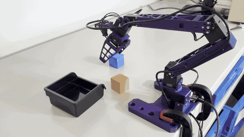

# openjev-cube-pick

Pick up a cube and drop it in a bin with a ROBOTIS OMX-F (the follower arm of the OMX-AI kit), instructed by voice: "put the red cube in the bin".



- **Understanding the instruction**: the speech is transcribed, and gpt-5.5 turns it into a list of pick / place tasks.
- **Coarse moves**: a VLM (gpt-5.5) marks the objects and the bin in the overhead camera image, and the arm moves above the target. No camera calibration file or fiducial markers: at start-up the arm visits a few poses around the begin pose (about 30 s), the gripper is marked in each overhead image, and that gives the image scale. Nothing about the objects' size is assumed, and nothing is stored between sessions.
- **Alignment and grasp**: a green cross is drawn on the wrist camera image where the point directly below the gripper appears. The decision layer ([openjev](https://github.com/razorback16/openjev), a TypeSafe Jev-compatible server running on a local GPU) is asked "is the target left or right of the cross?" and "above or below?". The arm steps toward the target, then descends straight down and grasps.

The decision layer never receives object coordinates. Motion is planned by solving IK on a MuJoCo digital twin, and joint targets are sent through ROS 2.

## Requirements

| | |
|---|---|
| Robot | OMX-F (follower arm) from the ROBOTIS OMX-AI kit, with a U2D2 |
| Cameras | Two USB cameras: a wrist camera fixed to the gripper, and an overhead camera looking straight down at the table |
| Microphone | Any device usable as the OS default input |
| Objects | Small objects the gripper can hold (tested: 3 cm cubes, a plush carrot, a tape roll) and a bin (box) with a rim about 4 cm high. Objects are named in the instruction or found in the overhead image; nothing depends on their names. Grasp and release heights are fixed (`Z_GRASP`, `BIN_RIM_Z` in `dlb/harness/twotier.py`), the place can also be a flat mark on the table (`--flat-place`), and stacking assumes objects about 3 cm tall (`CUBE_EDGE`) |
| PC | Ubuntu 24.04, NVIDIA GPU with 24 GB+ VRAM (for openjev), 64 GB RAM recommended, 30 GB+ free disk, Docker + NVIDIA Container Toolkit |
| Software | ROS 2 Jazzy, `python3-venv` |
| API key | OpenAI (instruction parsing and overhead image marking; billed per run) |

Tested on an RTX PRO 5000 Blackwell (Laptop, 24 GB). GPU driver and Docker setup notes are in [docs/setup_laptop.md](docs/setup_laptop.md).

## Setup and run

The overall flow is below. See the linked documents for the details of each step (the documents under `docs/` are written in Japanese).

1. **Install ROS 2 and the OMX-F driver** (section 1 of [docs/real_robot.md](docs/real_robot.md))
2. **Create the Python environment** (a virtual environment that can see ROS 2's `rclpy`)

   ```bash
   git clone https://github.com/tamon0987/openjev-cube-pick.git && cd openjev-cube-pick
   source /opt/ros/jazzy/setup.bash && source ~/ros2_ws/install/setup.bash
   /usr/bin/python3 -m venv --system-site-packages .venv
   source .venv/bin/activate
   pip install -e ".[real,voice,dev]"
   cp .env.example .env   # fill in OPENAI_API_KEY
   ```

   Every later command runs in a shell where these three `source` lines have been run (ROS 2, the workspace, then `.venv`).

3. **Bring up the arm and check it** (`scripts/real_check.py`)
4. **Record the begin pose and the table height for your rig** (`scripts/real_poses.py`)
5. **Register the cameras and calibrate the wrist camera** (`scripts/setup_cameras.py`, again whenever the cameras are re-attached; `scripts/calibrate_wrist_model.py`)
6. **Start the decision layer (openjev)** ([docs/openjev.md](docs/openjev.md); the first start downloads ~19 GB of weights and builds GPU kernels, which takes 20–30 minutes)
7. **Try a grasp only** (`scripts/real_grasp_only.py`)
8. **Start the speech-to-text server and instruct the robot by voice** ([docs/voice.md](docs/voice.md))

   ```bash
   bash scripts/stt_server.sh
   python -m dlb.voice.agent --objects "orange cube,blue cube" --bin-name "black bin"
   ```

Steps 3–7 are detailed in [docs/real_robot.md](docs/real_robot.md) (step 6 in [docs/openjev.md](docs/openjev.md)). The poses, gripper values and wrist camera calibration in `configs/robot/` come from the author's rig. Steps 3–5 check whether they fit yours (`scripts/calibrate_wrist_model.py --check` for the wrist camera) and say how to redo the ones that do not.

## ⚠️ Safety

This code moves a real robot arm.

- Start with low speeds (`max_tcp_speed` / `fast_tcp_speed` in `configs/robot/omx_f.yaml`), with no people or objects around the arm.
- Ctrl+C stops the run and the arm holds its last pose. Keep the power switch within reach for emergencies (cutting power releases the torque and the arm drops).
- To try things without the robot, use the ROS mock hardware (section 3 of [docs/real_robot.md](docs/real_robot.md)).

## Repository layout

| Path | Contents |
|---|---|
| `dlb/voice/` | Microphone input and utterance segmentation (`listen.py`), instruction parsing (`intent.py`), the voice agent (`agent.py`) |
| `dlb/harness/twotier.py` | Two-tier control with a planner and the decision layer: wrist-camera alignment (binary servo), failure detection and retries |
| `dlb/harness/marking.py` | VLM marking of the overhead image and online estimation of the table-to-pixel mapping |
| `dlb/real/` | Bridge to the real OMX-F (rclpy + OpenCV). `omx_kinematics.py` is a port of Show-Harness to the OMX-F |
| `dlb/sim/` | MuJoCo digital twin (OMX-F model, IK). Also runs standalone as a simulator |
| `dlb/backends/`, `dlb/contract.py` | Communication with the decision layer (TypeSafe Jev wire format). Supports openjev, the TypeSafe API and djev |
| `configs/robot/` | Real robot settings (ROS topics, poses, speed limits, cameras) and the wrist camera calibration |
| `configs/backends/` | Decision layer endpoints |
| `scripts/` | Starting openjev and the speech-to-text server; checking, pose recording, camera registration and calibration of the real robot |
| `docs/` | Guides for the real robot, openjev and voice; the decision layer wire format (`decision_contract.md`); GPU laptop setup |

`dlb/eval/` and `dlb gen / offline / online / report` are a benchmark for comparing decision layers on the same samples. They are not needed to run the robot.

## License

MIT for the code in this repository. See [NOTICE](NOTICE) for third-party components.

- `dlb/sim/assets/omx/`: the OMX model from [ROBOTIS mujoco menagerie](https://github.com/ROBOTIS-GIT/robotis_mujoco_menagerie) (Apache-2.0)
- `dlb/real/omx_kinematics.py`: the author's port of [Show-Harness](https://github.com/showlab/Show-Harness) (Apache-2.0) to the OMX-F
- openjev, DiffusionGemma, speaches and Silero VAD are subject to their own licenses.
